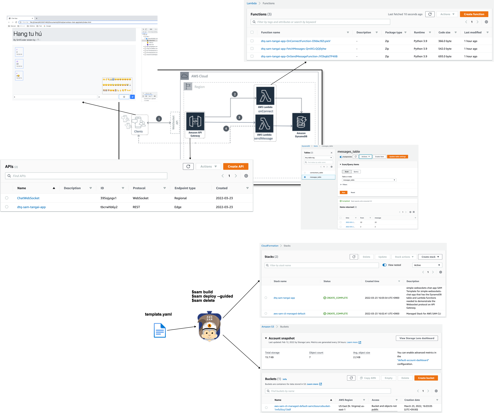

# aws-sam-lambda-apigw-websocket-chat-app 🐳


[](https://github.com/tquangdo/aws-sam-lambda-apigw-websocket-chat-app/issues/new)




## reference
[vtitech](https://vtitech.vn/tan-gai-365-tap-3-serverless-real-time-chat-app-cung-nang-tam-su-moi-toi/)

## project structure
├── fetchMessages               <-- Source code for get messages from DB

├── onConnect                   <-- Source code onConnect

├── sendMessage                 <-- Source code sendMessage

└── template.yaml               <-- SAM template for Lambda Functions and DDB

└── static                      <-- Frontend single page

## check version
```shell
python -V
# Python 3.9.10
```
- => MUST map with `template.yaml > Runtime: python3.9`

## deploy
1. ### SAM CLI
    - build:
    ```shell
    sam build
    ```
    - deploy:
    ```shell
    sam deploy --guided
    =>
    Deploying with following values
    ===============================
    Stack Name [sam-app]: dtq-sam-tangai-app
            AWS Region [us-east-1]: 
            #Shows you resources changes to be deployed and require a 'Y' to initiate deploy
            Confirm changes before deploy [y/N]: y
            #SAM needs permission to be able to create roles to connect to the resources in your template
            Allow SAM CLI IAM role creation [Y/n]: 
            #Preserves the state of previously provisioned resources when an operation fails
            Disable rollback [y/N]: 
            FetchMessages may not have authorization defined, Is this okay? [y/N]: y
            Save arguments to configuration file [Y/n]: 
            SAM configuration file [samconfig.toml]: 
            SAM configuration environment [default]: 

            Looking for resources needed for deployment:
            Creating the required resources...
            Successfully created!
    ...
    Previewing CloudFormation changeset before deployment
    ======================================================
    Deploy this changeset? [y/N]: y

    2022-03-23 16:04:38 - Waiting for stack create/update to complete

    CloudFormation events from stack operations
    -------------------------------------------------------------------------------------------------------------------------------------------------------------------------------------------------------------------------------------------------------------------------------------------------------------
    ResourceStatus                                                              ResourceType                                                                LogicalResourceId                                                           ResourceStatusReason                                                      
    -------------------------------------------------------------------------------------------------------------------------------------------------------------------------------------------------------------------------------------------------------------------------------------------------------------
    CREATE_IN_PROGRESS                                                          AWS::IAM::Role                                                              FetchMessagesRole                                                           Resource creation Initiated 
    ...
    ```
    - check API GW:
    ```shell
    brew install websocat
    websocat -V
    # websocat 1.9.0
    websocat wss://395ojysgx1.execute-api.us-east-1.amazonaws.com/Prod
    # {"message": "Forbidden", "connectionId":"PbTkjcISoAMCJNQ=", "requestId":"PbTk7ET8IAMFs2g="} => "connectionId" same with items in DynamoDB
    ```
    - delete:
    ```shell
    sam delete
    =>
            Are you sure you want to delete the stack dtq-sam-tangai-app in the region us-east-1 ? [y/N]: y
            Are you sure you want to delete the folder dtq-sam-tangai-app in S3 which contains the artifacts? [y/N]: y
            - Deleting S3 object with key dtq-sam-tangai-app/4bca9334aa116b0d348d9402ccf3803a
            ...
    ```
1. ### src code
    - edit in `static/index.js` with URI in AWS
    ```js
    const websocket_endpoint = "wss://###.execute-api.us-east-1.amazonaws.com/Prod"
    const fetch_messages_endpoint = "https://###.execute-api.us-east-1.amazonaws.com/Prod/prod"
    ```
1. ### check result
    - access `static/index.html` in browser, chat MSG and will see MSG inserted into DynamoDB
